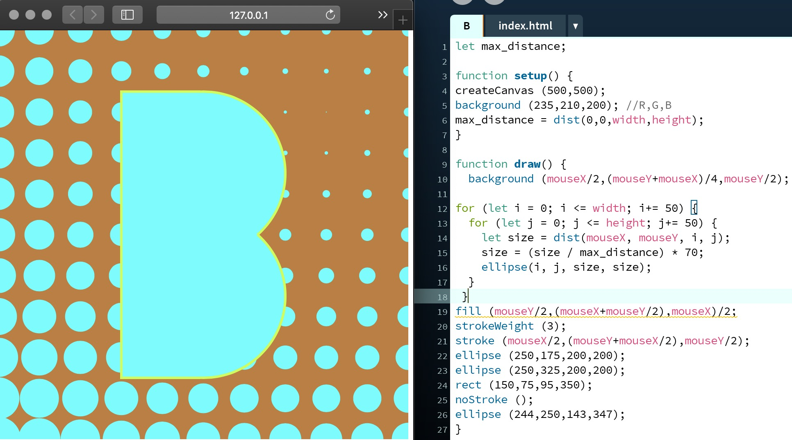

# Introduction 
## Week 1

My initials [*'B'*](https://bridieotoole.github.io/codewords/week_01/B/) and [*'O'*](https://bridieotoole.github.io/codewords/week_01/Owithdots/).

Our homework for the week was to create our initials on a 500x500 pixel canvas. I chose to create blocky, capital letters which change colour based on curser location.

I did some research for the background because I wanted something which was interactive and colourful but not overwhelming... I’m not sure if I've mastered the art of the most aesthetic coded characters, but I've enjoyed playing around with colours, shapes, outlines and size.

- | <a href='https://bridieotoole.github.io/codewords/week_02/'> --> Next Week/Hunting and Gathering </a>)
:-------------------------:|:-------------------------:

