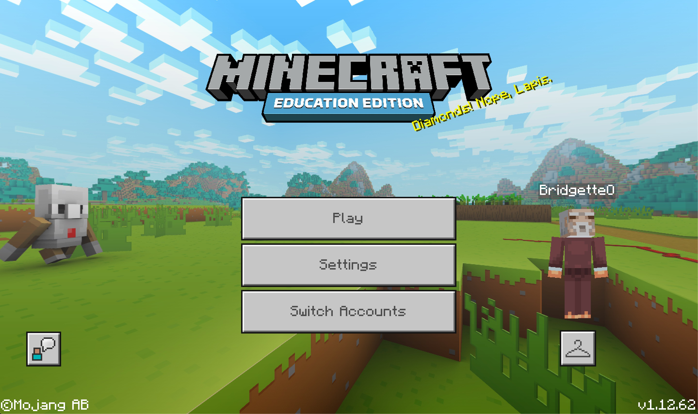

# Introduction 
## Week 1

In today's age, our concentration is limited and we are easily distrac... 
*What was the most recent book you interacted with?*
*What was the most recent long-form text you read?*
*Where do you get your news/info?*

...oh yes - we want our information quick, concise and in bullet points before commiting to giving our precious time to an article, lest a book.  
Opening the Semester, Andy and Karen introduced us to what we'd be covering over the next 13 or so weeks. Our first task will be covering a chapter of [*House of Leaves*] by Mark Z. Danielewski. In groups, we will perform an extract in a digital world.

The class explored a digital representation of Melbourne's CBD in Minecraft Education Education. 

My initials [*'B'*](https://bridieotoole.github.io/codewords/week_01/B/) and [*'O'*](https://bridieotoole.github.io/codewords/week_01/Owithdots/).

Our homework for the week was to create our initials on a 500x500 pixel canvas. I chose to create blocky, capital letters which change colour based on curser location.

I did some research for the background because I wanted something which was interactive and colourful but not overwhelming... I’m not sure if I've mastered the art of the most aesthetic coded characters, but I've enjoyed playing around with colours, shapes, outlines and size.

  
<a href='https://bridieotoole.github.io/codewords/week_02/'>Next Week/Hunting and Gathering --></a>

