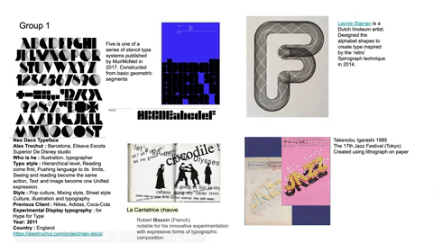

# Hunting and Gathering - Modular Typeface 
## Week 02

Today in class, we opened the day by huntering and gathering examples of moldular typefaces and showing these off in a [*Google Slide*](https://docs.google.com/presentation/d/1N2hAFp6si7UsVuPj1oMQ21_HHF858NbXZna0YQxOQio/edit#slide=id.p).  





Some of the found letterforms included epic, generative brutalist styles from Tais Ghelli, to contemporary and simplified forms from Ahn Sang Soo Mano and Logan Dufrn. 

```Image: Typeface created by Ahn Sang Soo Mano``` 

## Other Notable Practitioners

[Morgane Van Torre](http://morganevantorre.com) <br>
[Muriel Cooper](https://www.aiga.org/medalist-murielcooper) <br>
[MuirMcNeil (Paul McNeil and Hamish Muir)](https://muirmcneil.com/projects/) <br>
[Wim Crouwel](https://en.wikipedia.org/wiki/Wim_Crouwel)


While it wasn't necessary to have a digitally created typeface, the artist I selected is a linoleum artist. [*Leonie Staman*](https://www.detoffetoko.nl/leonie-staman) 3D prints her alphabet and manually traces these to create type inspired by the Spirograph techique most children will remember recieving as gifts from the 90's-00's. 

:-------------------------:|:-------------------------:
 | 


```Image: Artwork created by Leonie Staman, Dutch linoleum artist.``` 

## Re-readings 
In order to explore and re-tell our dedicated text House of Leaves, our group; Wen, Yutang, Faye, Peem and myself have decided to leap into the unknown Minecraft. Our [*machinima*](https://en.wikipedia.org/wiki/Machinima) themed project is to communicate a chapter from the horror and romance novel within a child dominated platform. The 8-bit inspired game is ruled by physics while having infitnite possibilities (all of which we have no idea how to use, this'll be the groups first time exeriencing this world).


<a href='https://bridieotoole.github.io/codewords/week_01/'> <-- Last Week/Introduction </a> | <a href='https://bridieotoole.github.io/codewords/week_03/'> Next Week/Electronic Literature --></a>


