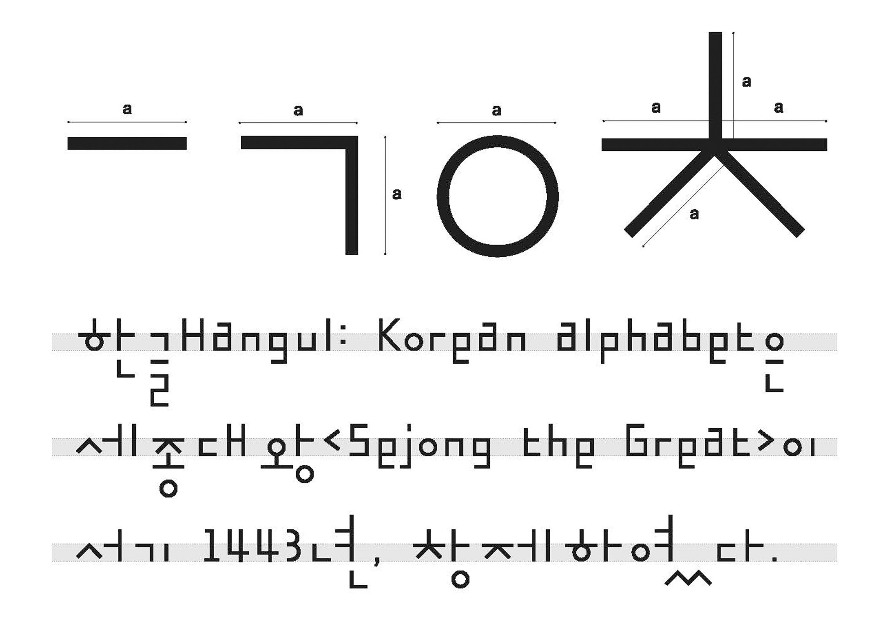
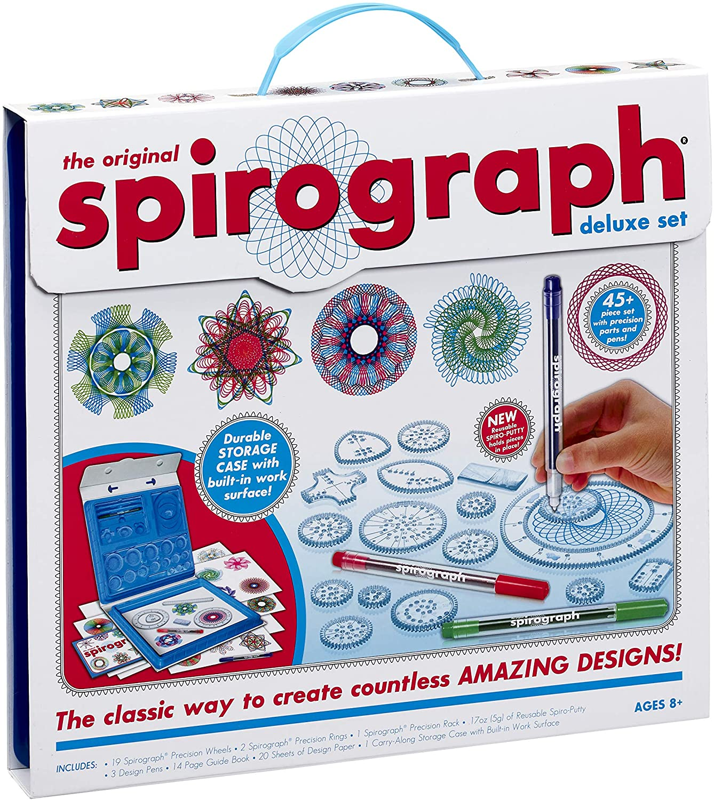

# Hunting and Gathering - Modular Typeface 
## Week 02


Today in class, we opened the day by huntering and gathering examples of moldular typefaces and showing these off in a [*Google Slide*](https://docs.google.com/presentation/d/1N2hAFp6si7UsVuPj1oMQ21_HHF858NbXZna0YQxOQio/edit#slide=id.p). Some of the found letterforms included epic, generative brutalist styles from Tais Ghelli, to contemporary and simplified forms from Ahn Sang Soo Mano and Logan Dufrn. 

```Image: Typeface created by Ahn Sang Soo Mano``` 

While it wasn't necessary to have a digitally created typeface, the artist I selected is a linoleum artist. [*Leonie Staman*](https://www.detoffetoko.nl/leonie-staman) 3D prints her alphabet and manually traces these to create type inspired by the Spirograph techique most children will remember recieving as gifts from the 90's-00's. 


```Image: Artwork created by Leonie Staman, Dutch linoleum artist.``` 

