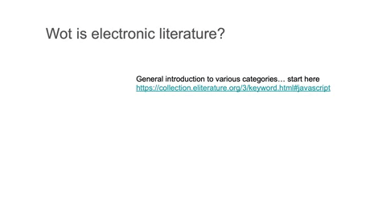

# Electronic Literature 
## Week 03

Electronic Literature emcompasses; chatbots, performance live coding, generative texts (eg. AI Dungeon), text animation, motion type and generative novels. I came across Aaron Reed, a writer, designer and researcher who focusses on finding new ways for gamemakers and players to tell stories together in his work [*Passive Aggresive (Procedural Novel)*](https://aaronareed.net/bots-and-generative-texts/)

## Re-Readings Development 

To collate our thoughts and cut down the script, our group has been working in a shared [Google doc](https://docs.google.com/document/d/19jYVR71h8XhRFNsr-k470x9JxL-L0lmXoieETXrT_1o/edit ) to achieve this.

<a href='https://bridieotoole.github.io/codewords/week_02/'> <-- Last Week/Hunting and Gathering </a> | <a href='https://bridieotoole.github.io/codewords/week_04/'> Next Week/Spinning Text --> </a>
  

