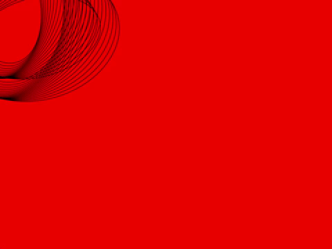
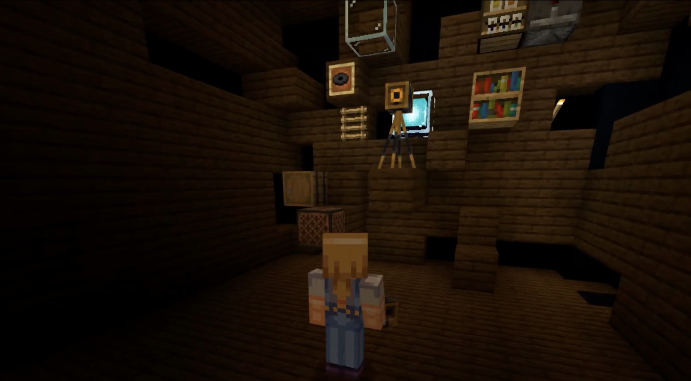

# Spinning Text

## Week 04 

We experimented in the afternoon with Karen in Processing. Our task was following creating spirographs and to [*spin text*](https://bridieotoole.github.io/codewords/week_04/fonttestspin/) with variables of text size and rotation direction depending on the mouse location. 

Fergus introduced us to the map function, which instead of a consistant rotation, could increase the speed of clockwise/anti-clockwise rotation depending on how far across the canvas the mouse is located. Today was one of the best days of student collaboration our class has had, instead of relying solely on the instruction and guidance of Karen and Andy(who have dominated, by the way)-perhaps one of the biggest limitations online teaching has shown this year.

Karen's Spiroworm | Spinning Text
:-------------------------:|:-------------------------:
 | 

# Re-reading development 

This week our group; Wen, Yutang, Faye, Peem and myself are refining the build of our Minecraft world for recording. My biggest limitation is the smooth recording. For some reason my content isn't displaying as consistant as the others. We've probably spent a few days re-shooting scenes for the best effect. 

 

<a href='https://bridieotoole.github.io/codewords/week_03/'> <-- Last Week/Electronic Literature </a> | <a href='https://bridieotoole.github.io/codewords/week_05/'> Next Week/Pre-Screening of Re-Reading --></a>

