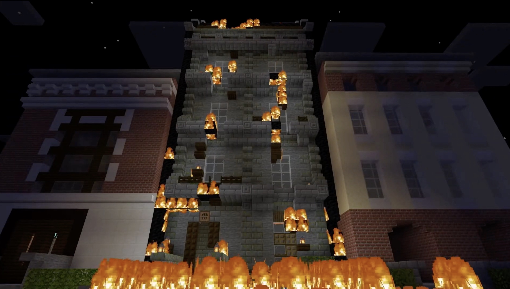

# Pre-screening of Re-reading
## Week 05

Our group used Minecraft EE to recreate the introduction chapter of House of Leaves. Despite all previously having gaming experience, none of the group had tried our hand at Minecraft before. This being a potential limitation causing huge setbacks, we dedicated many hours learning the new virtual world—a testament to the enthusiasm showed by myself and my teammates. Due to our varied experience, we each brought unique strengths and creative approaches to the vision: Wen and Faye have experience with After Effects and sound composition, Yutang has incredible film and production understanding and Peem is exceptionally optimistic and creative with designing sets and camera angles. I believe that I offered a sound understanding of the set-design and fresh perspective on the text, in order to help create structures capturing allegory and symbolism conveyed in the original text. 

[*Find our completed recording here.*](https://www.youtube.com/watch?v=uiOQQN-uh4c)

<a href='https://bridieotoole.github.io/codewords/week_04/'> <-- Last Week/Spinning Text </a> | <a href='https://bridieotoole.github.io/codewords/week_06/'> Next Week/Pseudo Pstuff --></a>

