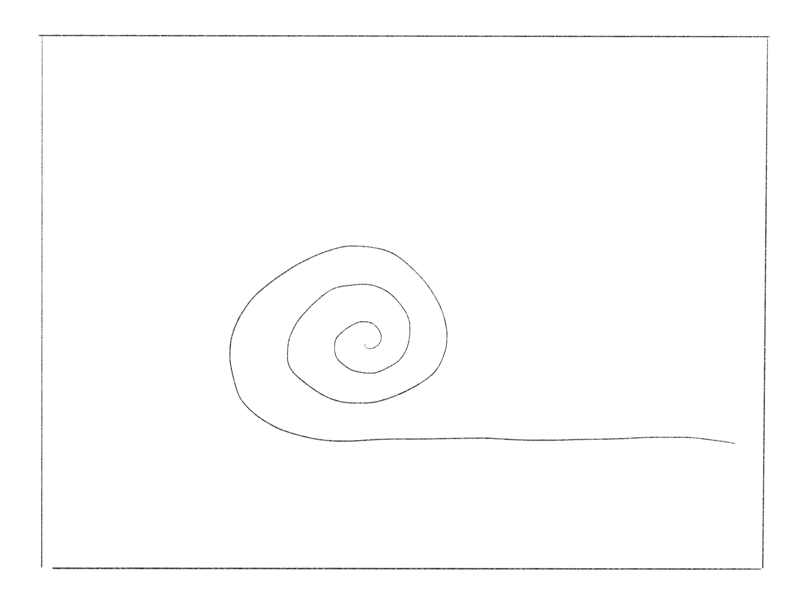
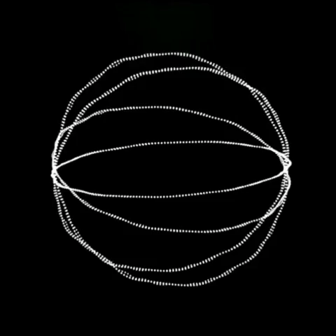

# Pseudo Pstuff

## Week 06 

Learning about Pseudo Code

```
START
  Pick up toothbrush, apply toothpaste to bristles 
INPUT 
  View teeth in mirror, measure tooth fur with tongue 
IF 
  furry 
OR 
  not white, brush for 2 minutes 
READ 
  reassess furriness 
WHILE 
  furRemains FLOSS 
END 
```

During the break we were tasked with creating a paper prototype for the major task. My chosen text is a reflective memoir on the process of creating by Mark Amerika. I love the dream-like state called ‘unrealtime’ he refers to. This stopping of, and traveling through time is what I wanted to portray this in the gif I created. 

"And yet this naked body of words just now starting to play out its creative potential is not really my own. It’s part of something much larger than me— some kind of dynamic, shape-shifting intersubjectivity where I am always losing sight of myself as I improvisationally interact with The Network and, without thinking about it, intuitively manipulate the pulse of Time (as if such a thing as Time could actually exist)." - [*Cyberpsychogeography by Mark Amerika*](http://digbeyond.com/readme/view.php?id=69&course=Code%20Words) (2007). 

The line in the gif is intended to represent the words pulled from Amerika's text.





Geos Oblivion by @aka_chang following the charming notes of @shahab_sahhaf - inspirstion shared by Jamie Tung to me.



<a href='https://bridieotoole.github.io/codewords/week_05/'> <-- Last Week/Pre-Screening of Re-Reading </a> | <a href='https://bridieotoole.github.io/codewords/week_07/'> Next Week/Making FUNctions --> </a>
:-------------------------:|:-------------------------:
