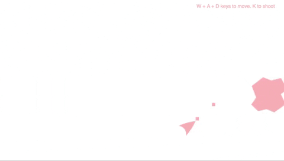
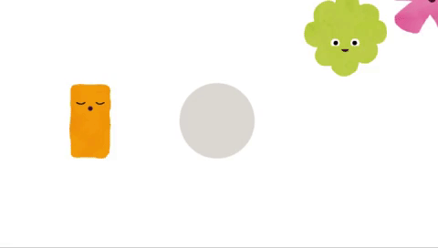
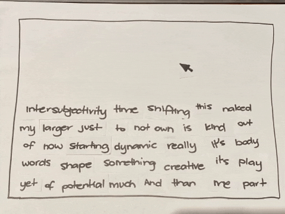

# Making FUNctions 

## Week 7 

~ reviewed our learninngs from the semester so far, from weeks 1-6

~ discussed the SKO submission for wk 13 and checked out the syllabus 

~ Talked about the Mark Marino book on Critical Code Studies 
  - he collaborated with data scientists and presented findings of climate change 
  - non executable code
  
~ which leads us into MORE pseudo code 

~ Karen discussed a very current issue for Australian Universities-cuts! 

(27 librarians to be let go this week, make-a-space - no longer and all HDR scholarships frozen...) 

```
Karen's Code
#include <australianUniversities.h>
#include <HEstaff.h>
#include <NTEU.h>
#include <students.h> 

void fightTheCuts() {
  while (cuts > 0) {
    resist ();
    print (“Fight The Cuts!”);
    protest++; 
    discuss();
  }
  print (“university belongs to all Australians”);
} 
``` 
## P5 Play

P5 Play Background Game | *[P5 Play Collisions Example]*(https://molleindustria.github.io/p5.play/examples/index.html?fileName=collisions.js)
:-------------------------:|:-------------------------: 
 | 

~ Later in the lesson, we explored P5 Play

~ I FREAKING LOVE THESE GAMES 

~ Example of P5js remix soundtest with Karen 

## Further Paper Prototyping

 

<p align="center">

<a href='https://bridieotoole.github.io/codewords/week_06/'> <-- Last Week/Pseudo Pstuff </a> | <a href='https://bridieotoole.github.io/codewords/week_08/'> Next Week/Objectified --> </a>
  
</p>
