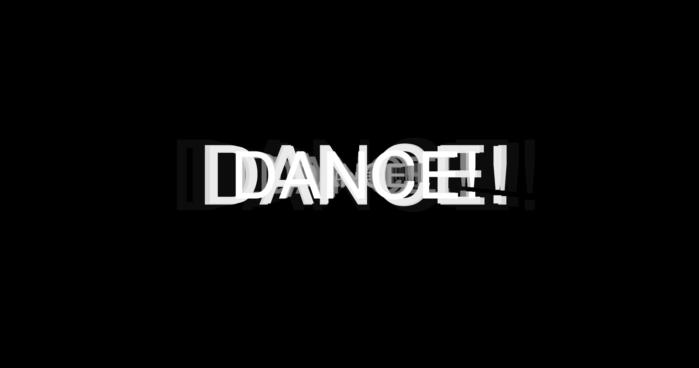

# Making FUNctions 

## Week 07 

Back from our mid-semester break! To start the day off we reviewed our learninngs from the semester so far, from weeks one to six. 

Highlights from the class: 
- Spirographs 
- AI dungeon 
- Minecraft 
- Generative novels 
- Spinning type 
- Machineima  
- Text to talk
- Remixing 

After recapping what we've covered, we delved into what's to come and what is expected for our Major and SKO. The best part about using Github for documentation is that we can suport, add-to, and peruse the achievements of others in the class. [Amy Leger's Github](https://astlcreations.github.io/codewords-codes-words/) was the focus of today - her reflections are thoughtful and consise. Deffinitely worth taking a leaf out of Amy's book. 

Andy and Karen introduced us to the work of Mark Marinio and his book on Critical Code Studies. Using non executble code, he colloabrated with data scienctists and presenting his findings of climate change. This lead us into MORE pseudo code and the very current issue of Australian University Cuts for which Karen made her own protest pseudo code below. The one of the most difficult parts of social distancing this year has stopped a lot of honest conversation. Class time doesn't usually allow for casual converations regarding the university or politics for that matter, but to hear what was coming for RMIT, this week alone, is heartbreaking. Make-A-Space: no longer, 27 librarians to be let go, FORCED REDUNDANCIES and all HDR scholarships frozen. These moments where Karen and Andy share current changes effecting us all is invaluable. 

```
Karen's Code
#include <australianUniversities.h>
#include <HEstaff.h>
#include <NTEU.h>
#include <students.h> 

void fightTheCuts() {
  while (cuts > 0) {
    resist ();
    print (“Fight The Cuts!”);
    protest++; 
    discuss();
  }
  print (“university belongs to all Australians”);
} 
```

## P5 Play

Later in the lesson we explored libraries within p5js. This lead us explore p5 Play... Is it okay if i spend the rest of the week here? These games are simple, clean and incredibly addictive. It really opened my eyes up to what is possible with code. 

[*P5 Play Background Game*](https://molleindustria.github.io/p5.play/) | [*P5 Play Collisions Example*](https://molleindustria.github.io/p5.play/examples/index.html?fileName=collisions.js)
:-------------------------:|:-------------------------: 
 | 

## Coding with Karen 



```
var song; //initiating our variable
var analyzer;
function preload() {
 song = loadSound ('data/groove.mp3'); 
}

function setup() {
  //song = loadSound ('data/groove.mp3'); //associate our sound to the variable 'song'
  createCanvas (windowWidth, windowHeight); // create full window canvas
  background(0);
  analyzer = new p5.Amplitude();
  analyzer.setInput(song);
  fill(120);
  textSize(72);
  textAlign(CENTER,CENTER);
}

function draw() {
  background(0, 10);
  fill(120);
  var volume = analyzer.getLevel();
  volume*=400;
  //ellipse(width/2,height/2,volume,volume);
  fill(255);
  textSize(volume*2);
  text('DANCE!', width/2, height/2);
}

function mousePressed() {
  if (song.isPlaying()) {
    background(255);
    song.stop(); // if the song is playing, stop it
    song.noLoop();
  }
  else {
    background(0);
    song.loop();
    song.play();
  }
}
```

## Further Paper Prototyping

 

<a href='https://bridieotoole.github.io/codewords/week_06/'> <-- Last Week/Pseudo Pstuff </a> | <a href='https://bridieotoole.github.io/codewords/week_08/'> Next Week/Objectified --> </a>
  
