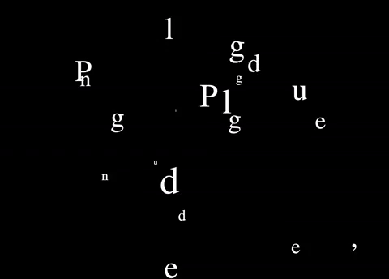
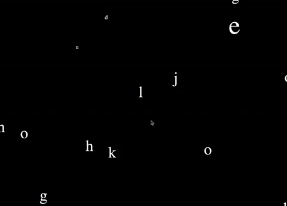

# Objectified 

## Week 08

Today was a chance to share our paper prototypes in small groups to help develop our code and recieve feedback from our peers. Andy reinforced that our code is to focus on the text using only typography and code! 

Feedback:
- Have the words dissolve/ fade instead of click away 
- Look into perlin noise
- Typography is fundamental
- Keep creating and making many solutions to the problem 

~ datamoshing 

## Coding with Karen

A sketch to learn about "class" contruction 

[*Stack Over Flow Definition*](https://stackoverflow.com/questions/3686647/whats-the-best-way-to-define-the-words-class-and-object-to-someone-who-hasn) 
"A class is kind of the blueprint or template that describes the methods and variables that will be in each object. An object is an instantiated (instance of a) class; an object is something, while the class is simply the plans to make that something." 

['Plugged In' Click Text](https://bridieotoole.github.io/codewords/week_08/Plugged_in_turned_on_repeated_17_sept_/) | [Key Pressed Text With Speed Reactive Mouse](https://bridieotoole.github.io/codewords/week_08/wigglyletterstyped7sept/) 
:-------------------------:|:-------------------------:
 | 

<a href='https://bridieotoole.github.io/codewords/week_07/'> <-- Last Week/Making FUNctions </a> | <a href='https://bridieotoole.github.io/codewords/week_09/'> Next Week/An Admiral Start --> </a>

