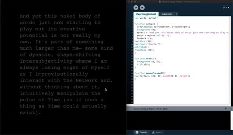

# An Admiral Start
## Week 09

I feel somewhat slow to launch. The overwhelming possibly of what to create in Processing and also have that user interaction relay and translate the meaning of Mark Amerika's text is crippling!! Speaking with others in class is helpful, I know that through sharing ideas and resources we will all achieve some pretty impressive results but maybe thats why COVID has been especially difficult for study and collaboration.

With Karen, achieving the printed text to screen felt like the biggest hurdle that anything afterwards would be a couple of extra tweaks. This is proving not to be quite as simple. I feel like I'm coding the most ridiculous classes and begging p5 to guess what I'm hoping to achieve. Back to the drawing board. I know my skills aren't there yet. So a few hundred more hours of perusing references and tutorials should be the right direction. 

## Notable Practitioner
[Tim Roden Broeker](https://timrodenbroeker.de)

In my endlesss hopes and code manipulation, I've created a 'pulse' for the text to appear and fade off the screen. I feel like this speaks to Amerika's 'pulse of time', this could be super poetic and require user engagement to read the text. But so far all this clicking for an on-screen event is giving me RSI. 

<a href='https://bridieotoole.github.io/codewords/week_08/'> <-- Last Week/Objectified </a> | <a href='https://bridieotoole.github.io/codewords/week_10/'> Next Week/Noto Type --> </a>
