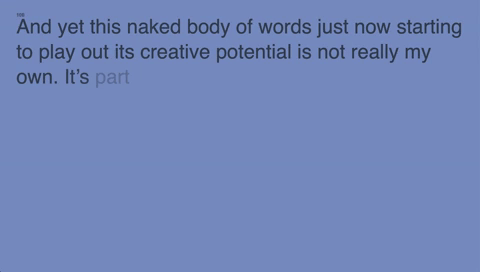

# Noto Type 
## Week 10 

*Are robots replacing humans at work?*  
Yes.   
But in doing this, we have new information readily available for us to use, learn from, create with and design! 
I'm referencing [*Google Noto*](https://www.google.com/get/noto/) which Karen and Andy showed us. This has infinite possibilities for our Major project. 

Today in class we presented a milestone checkpoint. [*Here*](https://bridieotoole.github.io/codewords/week_10/PeriwinkleTypedText/) is where I'm at this week. Working now to have words dissapear/dissolve/'float' down window with mouse pressed function, or mouse hover. Even find a way to redraw the background and fade the 'old' words. 

### Inspiration for next iteration: 

[*Snowflakes by Aatish Bhatia*](https://p5js.org/examples/simulate-snowflakes.html) | Up Banking - Savers Goal
:-------------------------:|:-------------------------:
 | 

Through some digging, I found this example replicated the sinking I'd like to create with words disspearing from the screen. Because Amerika's text refers to 'stopping of time', I feel the weightlessness of water to be somewhat a close analogy.

<a href='https://bridieotoole.github.io/codewords/week_09/'> <-- Last Week/An Admiral Start </a> | <a href='https://bridieotoole.github.io/codewords/week_11/'> Next Week/Week 11 --> </a>
  

