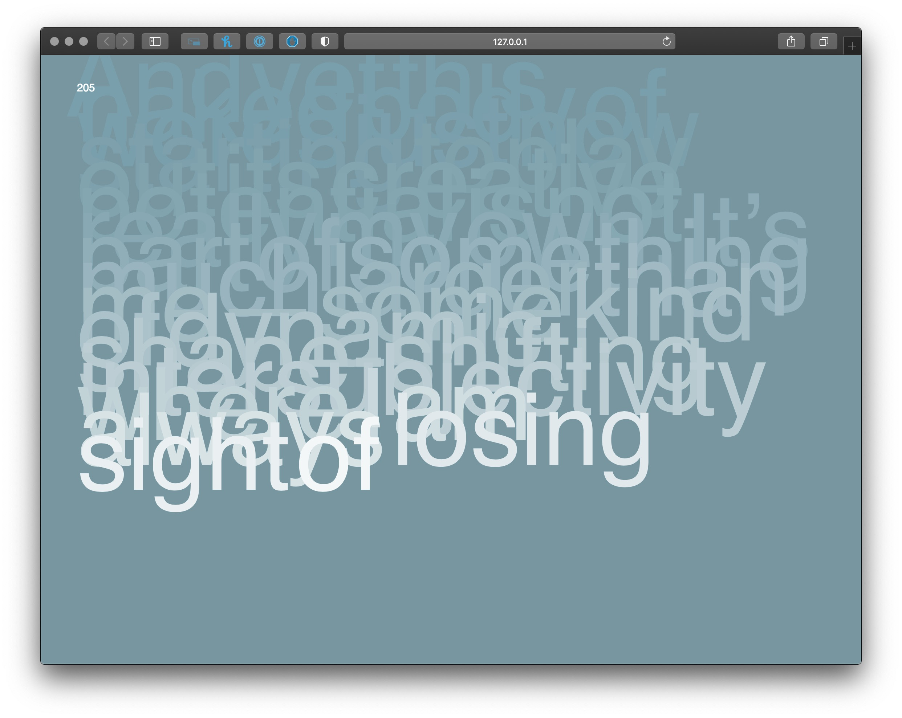

# Artist Statement

## Week 11 

[*Here*](https://bridieotoole.github.io/codewords/week_11/StruggleCodeRefresh/) is my most recent attempt have my words fall with click! 
As you can see I've not made any progress.. I'm losing faith in my abilties now... less than a week before due date!!! eeeek 

```

/* Code for para-split created by Karen Donnachie
Modified to fall with user interaction by Bridie O'Toole*/ 
//10 October 2020
var font, wx, wy, fx, fy, word, value;
var points1 = [];
var margin = 50;
var topMargin = 50;
var para = 'And yet this naked body of words just now starting to play out its creative potential is not really my own. It’s part of something much larger than me—some kind of dynamic, shape-shifting intersubjectivity where I am always losing sight of myself as I improvisationally interact with The Network and, without thinking about it, intuitively manipulate the pulse of Time (as if such a thing as Time could actually exist).';
var words = para.split(' '); 
var typeSize = 36; 
var kerning = 12; 
var leading = 50; 
var fallWords = [];

function preload(){
  font = loadFont('data/Akzidenz-Grotesk-Medium.otf');
}


function setup() {
 createCanvas(windowWidth, windowHeight*9.87);
 background(120,150,160);
 strokeWeight(2);
 value = (255);
 fill(value);
 textSize(typeSize);
 textFont(font);
 var para = 'And yet this naked body of words just now starting to play out its creative potential is not really my own. It’s part of something much larger than me—some kind of dynamic, shape-shifting intersubjectivity where I am always losing sight of myself as I improvisationally interact with The Network and, without thinking about it, intuitively manipulate the pulse of Time (as if such a thing as Time could actually exist).';
 var words = para.split(' '); 
   for (let w=0; w<words.length; w++){
    if (wx+textWidth(words[w])<=width-margin){
      points1=font.textToPoints(words[w], wx, wy+50, typeSize, 1); 
      noStroke();                             //turn off after debugging
    if (frameCount>5*w){
      text(words[w], wx, wy+50);
      for (let i=0; i < points1.length; i++){
        noStroke(0);                           //turn off after debugging
        point(points1[i].x, points1[i].y);
        }
    }
    wx+= textWidth(words[w])+kerning; 
    }
    else {
      wx = margin;
      wy+= leading;
      w--;  
    }
  }
}


function draw() {
  background(120,150,160);
  wx = margin;
  wy = 50; 
  textSize(typeSize);
  for (let w=0; w<words.length; w++){
    if (wx+textWidth(words[w])<=width-margin){
      points1=font.textToPoints(words[w], wx, wy+50, typeSize, 1); 
      noStroke();                             //turn off after debugging
    if (frameCount>5*w){
   text(words[w], wx, wy+50);
      for (let i=0; i < points1.length; i++){
        noStroke(0);                           //turn off after debugging
        point(points1[i].x, points1[i].y);
        }
    }
    wx+= textWidth(words[w])+kerning; 
    }
    else {
      wx = margin;
      wy+= leading;
      w--;  
    }
    for (var f=0; f<fallWords.length ; f++){
      fallWords[f].update();
      fallWords[f].display();
    }
  }
  textSize (15);  //turn off after debug
  text(frameCount, 50,50); //turn off after debug
}

function mousePressed(){
   if (value === 255); {
     fallWords.push(new Fall (points1[i].x, points1[i].x, letter, speed));
   }
}


class Fall {
  constructor (x, y, word, width, height, active){ // (word, x, y, width of box, height of box, active) 
  this.x = x; 
  this.y = y; 
  this.word = (words[w]);
  this.width = points1[i].x; //or width 
  this.height = points1[i].x; // or height 
  //this.active = ;
  }
  
  update() {
    this.x += random (-3,3);
    this.y += random (-1,4);
  }
  
  display() {
    if (value === 255); {
      
    text(this.word, this.x, this.y);
  } 
  }
}
```
 

Along the way, I STRUGGLED big time to some how make effective changes to my code... incoming 'big mess'. So I finally decided after reading (and re-reading) Karen and Andy's email advising us, if we hadn't achieved all of our hopes and dreams, to roll it back to a version that works. 

During class today Andy gave me some great ideas to incorperate some beautiful music paired with the appearing words, so my hunt began... I stumbled into a classical playlist at the bottom of my music library and found some Bach. What's more beautiful and timeless? 


<a href='https://bridieotoole.github.io/codewords/week_10/'> <-- Last Week/Noto Type </a> | <a href='https://bridieotoole.github.io/codewords/week_12/'> Next Week/Lost In Time --> </a>
