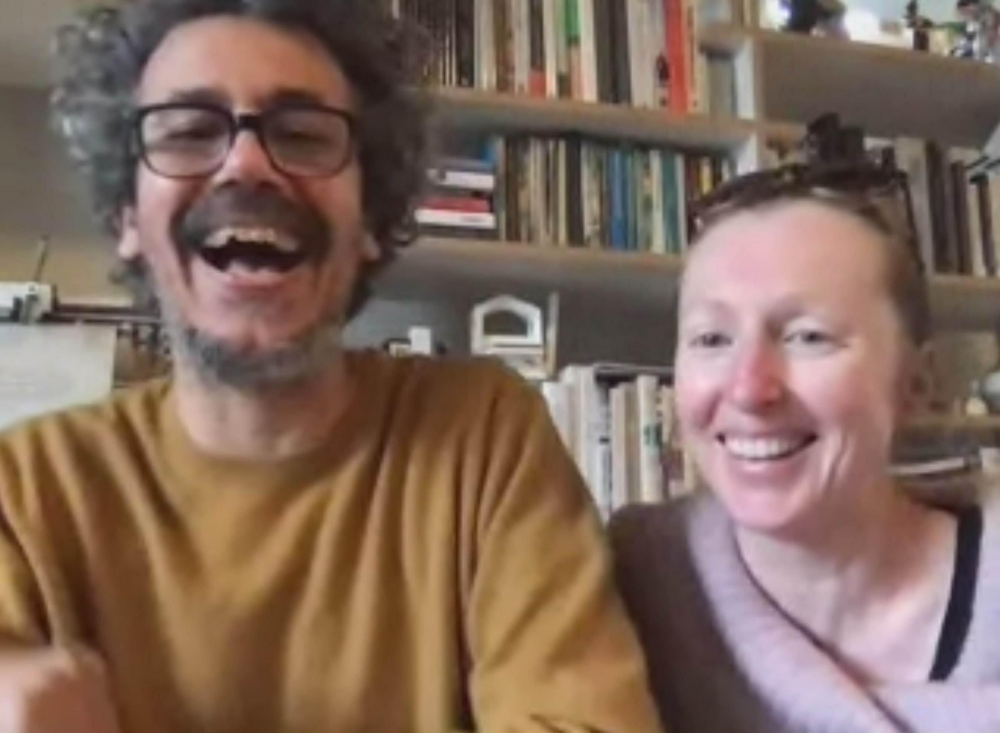

# Lost In Time

## Week 12

Here's what we've all been waiting for... [*The Major: Lost In Time*](https://bridieotoole.github.io/codewords/week_12/LostInTime/)

Lost In Time is an interpretative visual of an extract ‘Cyberpsycogeography’ by Mark Amerika. America explores how the creative potential is unlocked and experienced in a dream-like state called ‘unreal time’. America continuously loses himself in new personas, distributed in the field he operates, regardless of physical location.

Amerika impresses the importance of positioning himself to move beyond the contemporary—though the declaration ‘as if such a thing as Time could actually exist’, poses the question if his former statement is even possible in his mind. He resolves, that consciousness can be achieved anywhere at anytime.

To embody the etherial essence of losing sense of time, a rendition of the timeless second movement ‘Air on the G String’ by J.S Bach is paired for its suspension-in-time melancholy melody to slow the reader in order to absorb the reflective memoir.

Through iterative design choices, I played with the concept of being submerged underwater. The weightlessness forced upon all objects once below is the closest sensation we can experience to the stopping of time. I’ve chosen a murky pale blue background for the ‘white-wash’ text to float beneath and drift away from view. 


```
/* Code for para-split by Karen Donnachie
Modified by Bridie O'Toole*/ 
//14 October 2020
var font, wy, wy, song, analyzer;
var points1 = [];
var margin = 50;
var topMargin = 50;
var para = 'And yet this naked body of words just now starting to play out its creative potential is not really my own. It’s part of something much larger than me— some kind of dynamic, shape-shifting intersubjectivity where I am always losing sight of myself as I improvisationally interact with The Network and, without thinking about it, intuitively manipulate the pulse of Time (as if such a thing as Time could actually exist).';
var words = para.split(' '); 
var typeSize = 50; 
var kerning = 12; 
var leading = 70; 
var t = frameCount;


function preload() {
  font = loadFont('data/AGMedium.otf');
  song = loadSound('data/BachSuiteNo.3AriainDmajor.mp3');
}

function setup() {
  createCanvas(windowWidth, windowHeight*1.5);
  textSize(typeSize);
  strokeWeight(2);
  background(120, 150, 160);
  analyzer = new p5.Amplitude();
  analyzer.setInput(song);
}

function draw() {
  let t = frameCount;
  fill(250);
  wx = margin;
  wy = 50; 
  textSize(typeSize);
  for (let w=0; w<words.length; w++) {
    if (wx+textWidth(words[w])<=width-margin) {
      if (t>30*w) {      
        text(words[w], wx, wy+50);
       for (let i=0; i < points1.length; i++) {
        }
        background(120, 150, 160, 45);
      }
      wx+= textWidth(words[w])+kerning;
    } else {
      wx = margin;
      wy+= leading;
      w--;
    }
  }
  textSize (15);
  fill(200);
//  text (t, 50,50); //toggle off after debug
  text('Cyberpsychogeography by Mark Amerika', margin, (windowHeight*1.5)-margin);
} 

function mousePressed() {
  if (song.isPlaying()) {
    song.stop();
    song.noLoop();
  }
  else {
    song.play();
  }
}
```



<a href='https://bridieotoole.github.io/codewords/week_11/'> <-- Last Week/Roll Back And Take Some Deep Breaths </a>
  
